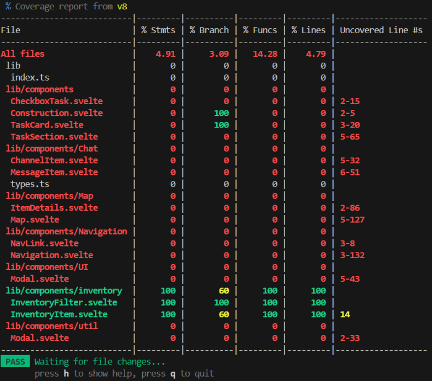
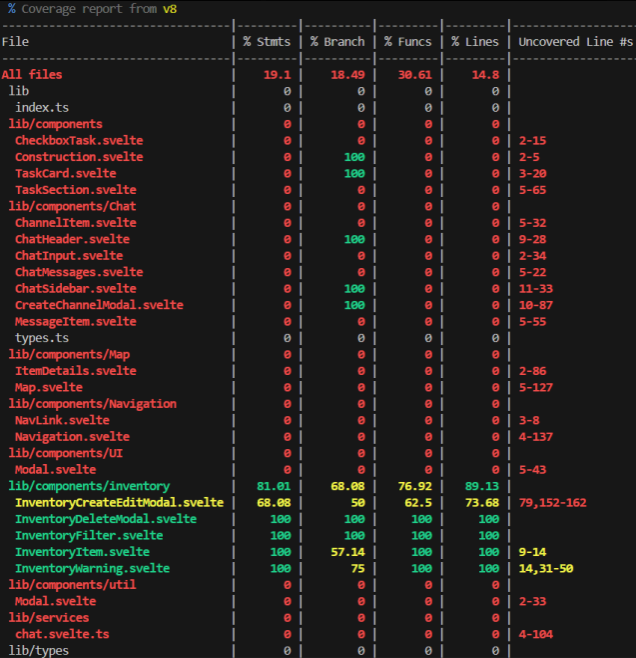
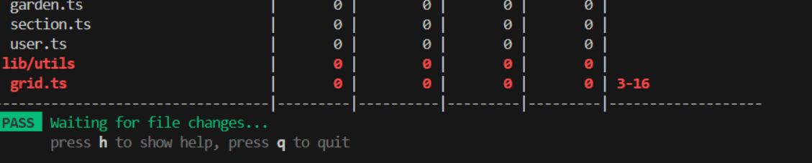
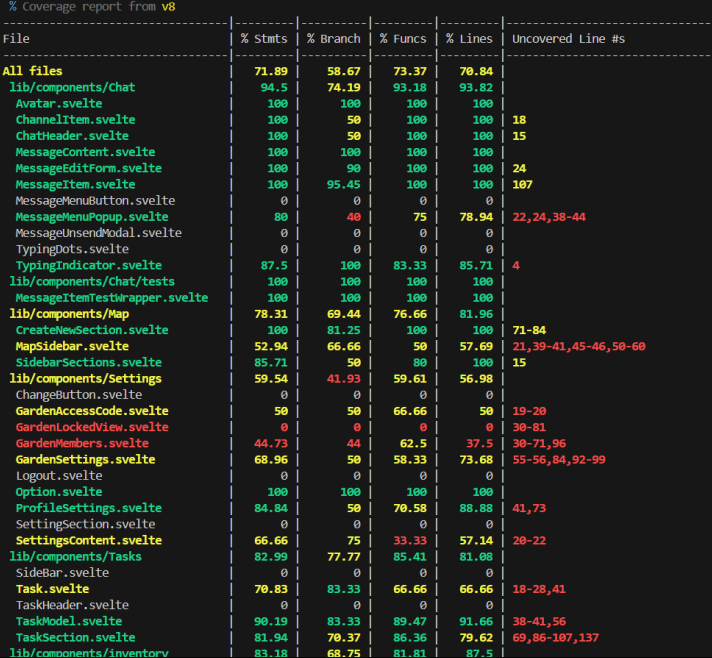
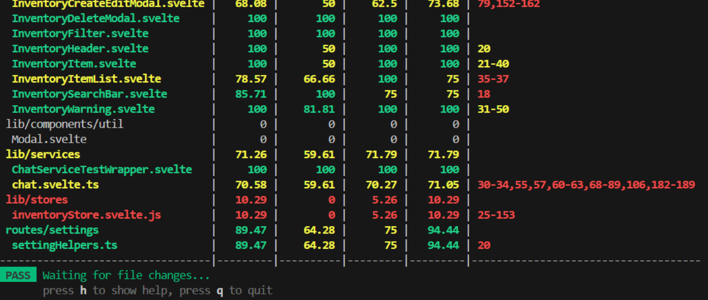
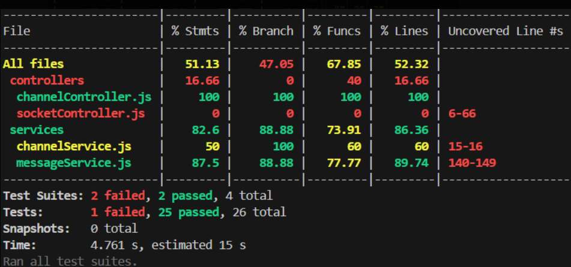
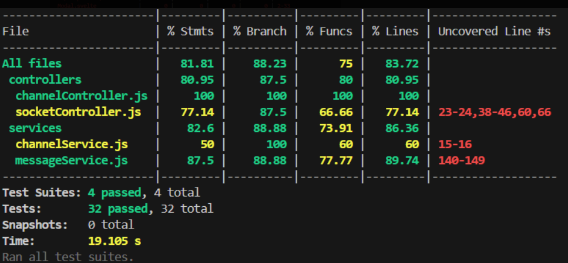
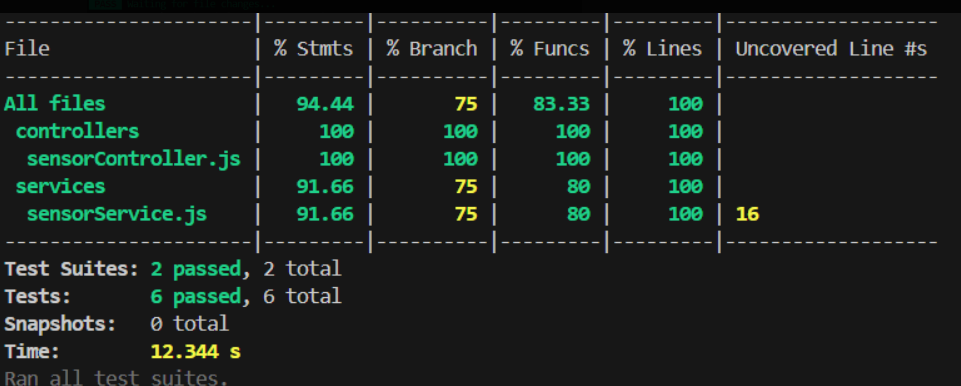
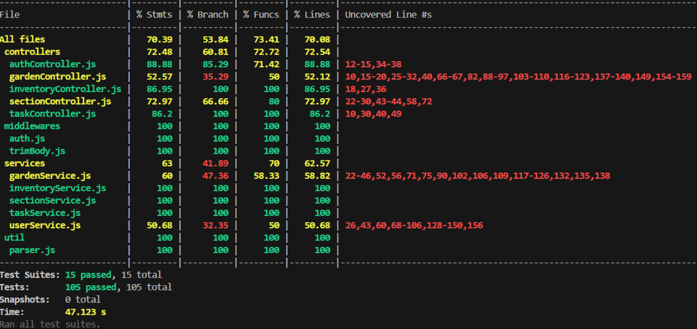

# Code coverage

## Overview

An overview of the front/backend code coverage increases over each release

## Frontend
### Release 1

### Release 2

### Release 3

## Backend
### Release 1
No coverage at release 1

### Release 2
#### Chat

#### Sensors
No coverage for sensors at release 2

#### Server
No coverage for server at release 2

### Release 3
#### Chat

#### Sensors

#### Server
